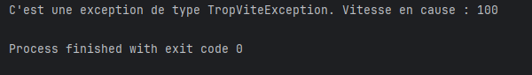

# TropViteException Class

```` java
public class TropViteException extends Exception{
    public TropViteException(double vitesse) {
        super("C'est une exception de type TropViteException. Vitesse en cause : " + vitesse);
    }
} 
````

The `TropViteException` class is a custom exception triggered when the speed exceeds a certain limit. It extends the `Exception` class and is used to handle specific cases where an excessive speed is detected.

### Attributes
No specific attributes are defined in this class, but it includes a custom message to indicate the speed that caused the exception.

### Constructors
- `TropViteException(double vitesse)`: Creates an instance of `TropViteException` with a message indicating the speed involved.
    - **Parameter**:
        - `vitesse` (double): The speed that triggered the exception.

### Methods
This class inherits methods from the `Exception` class. The exception message is customized to include the speed.

### Usage Example
This exception can be used to monitor the speed of an element and trigger an alert if the limit is exceeded.

---

# Vehicule Class

```` java
public class Vehicule {
    public Vehicule() {
    }

    public static void main(String[] args) {
        Vehicule vehicule = new Vehicule();
        try {
            vehicule.testVitesse(89);
            vehicule.testVitesse(100);

        }catch (TropViteException e){
            System.out.println(e.getMessage());
        }

    }

    public void testVitesse(double vitesse) throws TropViteException{
        if(vitesse > 90){
            throw new TropViteException(vitesse);
        }
    }
}
````

The `Vehicule` class represents a vehicle that controls its speed using the `testVitesse` method. If the speed exceeds a specified limit (90 in this example), it triggers a `TropViteException`.

### Methods
- `Vehicule()`: Default constructor for the `Vehicule` class.
- `void testVitesse(double vitesse) throws TropViteException`: Tests if the given speed exceeds the limit. If so, it throws a `TropViteException` with the speed involved.
    - **Parameter**:
        - `vitesse` (double): The speed to test.
    - **Exception**:
        - `TropViteException`: Thrown if the speed exceeds the limit of 90.

### Usage Example
The main program creates a `Vehicule` object and tests several speeds. If the speed exceeds the limit, the exception message is displayed in the console.

## Execution Screenshot
Below is a screenshot of the code execution :
******
