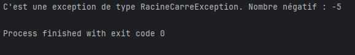

# RacineCarreException Class
```` java
public class RacineCarreException extends Exception{
public RacineCarreException(int valeur) {
super("C'est une exception de type RacineCarreException. Nombre négatif : "+valeur);
}
}
````

The `RacineCarreException` class is a custom exception triggered when a negative number is provided for a square root operation. It extends the `Exception` class and is used to handle specific cases where a square root of a negative number is attempted.

### Attributes
No specific attributes are defined in this class, but it includes a custom message to indicate the negative value that caused the exception.

### Constructors
- `RacineCarreException(int valeur)`: Creates an instance of `RacineCarreException` with a message indicating the value involved.
    - **Parameter**:
        - `valeur` (int): The negative value that triggered the exception.

### Methods
This class inherits methods from the `Exception` class. The exception message is customized to include the negative value.

### Usage Example
This exception can be used in contexts where square roots are only allowed for positive numbers. If a negative number is encountered, it triggers an alert with the appropriate exception message.

---

# Calculateur Class

```` java
public class Calculateur {

    public Calculateur() {
    }

    public static void main(String[] args) {
        Calculateur calculateur = new Calculateur();
        try {
            calculateur.testRacineCarre(10);
            calculateur.testRacineCarre(-5);


        }catch (RacineCarreException e) {
            System.out.println(e.getMessage());
        }
    }

    public void testRacineCarre(int valeur) throws RacineCarreException{
        if(valeur < 0){
            throw new RacineCarreException(valeur);
        }
    }

}
````

The `Calculateur` class performs mathematical operations, specifically testing the validity of a number for calculating its square root. It uses the `RacineCarreException` class to handle cases where an attempt is made to calculate the square root of a negative number.

### Methods
- `Calculateur()`: Default constructor for the `Calculateur` class.
- `void testRacineCarre(int valeur) throws RacineCarreException`: Tests if the given value is negative. If so, it throws a `RacineCarreException`.
    - **Parameter**:
        - `valeur` (int): The value to test for square root validity.
    - **Exception**:
        - `RacineCarreException`: Thrown if the value is negative.

### Usage Example
The main program creates a `Calculateur` object and tests several values. If a negative value is provided, the exception message is displayed in the console.
## Execution Screenshot
Below is a screenshot of the code execution :
******