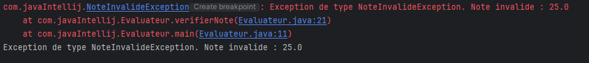

# NoteInvalideException Class

```` java
public class NoteInvalideException extends Exception{
    public NoteInvalideException(double valeur) {
        super("Exception de type NoteInvalideException. Note invalide : "+ valeur);
    }
}
````

The `NoteInvalideException` class is a custom exception triggered when an invalid grade is provided. It extends the `Exception` class and is used to handle cases where a grade outside the allowed range (typically between 0 and 20) is entered.

### Attributes
No specific attributes are defined in this class, but it includes a custom message to indicate the invalid grade that caused the exception.

### Constructors
- `NoteInvalideException(double valeur)`: Creates an instance of `NoteInvalideException` with a message indicating the grade involved.
    - **Parameter**:
        - `valeur` (double): The invalid grade that triggered the exception.

### Methods
This class inherits methods from the `Exception` class. The exception message is customized to include the invalid grade.

### Usage Example
This exception can be used in contexts where grades must be validated before being accepted, such as when entering student grades. If an invalid grade is provided, the exception is triggered with an appropriate message.

---

# Evaluateur Class

```` java
public class Evaluateur {
public Evaluateur() {
}

    public static void main(String[] args) {
        Evaluateur evaluateur = new Evaluateur();
        try {
            evaluateur.verifierNote(15);
            evaluateur.verifierNote(25);

        } catch (NoteInvalideException e) {
            e.printStackTrace();
            System.out.println(e.getMessage());
        }
    }

    public void verifierNote(double note) throws NoteInvalideException {
        if(note < 0 || note > 20){
            throw new NoteInvalideException(note);
        }
    }
}
````

The `Evaluateur` class is designed to validate student grades. It uses the `verifierNote` method to ensure that the provided grades fall within a valid range (typically between 0 and 20). If an invalid grade is entered, a `NoteInvalideException` is thrown.

### Methods
- `Evaluateur()`: Default constructor for the `Evaluateur` class.
- `void verifierNote(double note) throws NoteInvalideException`: Checks if the given grade is valid. If the grade is less than 0 or greater than 20, it throws a `NoteInvalideException`.
    - **Parameter**:
        - `note` (double): The grade to validate.
    - **Exception**:
        - `NoteInvalideException`: Thrown if the grade is outside the allowed range.

### Usage Example
The main program creates an `Evaluateur` object and tests several grades. If an invalid grade is provided, the exception is caught, and the error message is displayed in the console.
## Execution Screenshot
**Below is a screenshot of the code execution :**

******
